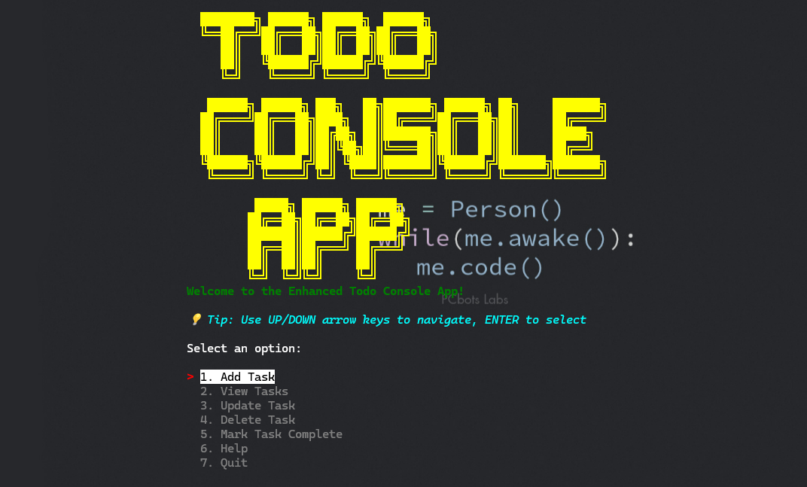

# Todo Console App - Phase I
[](https://youtu.be/aNeLKW3UwqM)
This is Phase I of the Todo Evolution project: an In-Memory Python Console App. The goal is to create a command-line todo application that stores tasks in memory, implementing all 5 Basic Level features using spec-driven development with Claude Code and Spec-Kit Plus. This implementation also includes reusable intelligence components for bonus points.


## Features

The application implements all 5 Basic Level features:

1. **Add Task** – Create new todo items
2. **Delete Task** – Remove tasks from the list
3. **Update Task** – Modify existing task details
4. **View Task List** – Display all tasks
5. **Mark as Complete** – Toggle task completion status

## Reusable Intelligence (Bonus Component)

This project includes reusable intelligence components for enhanced AI interaction:

- **Agent Skills**: The `@.claude/commands/todo_management.skill` file defines functions for AI agents to manage tasks programmatically
- **Functions available**: `add_task`, `view_tasks`, `update_task`, `delete_task`, `mark_task_complete`, `get_task`
- **Implementation**: `src/phase_i_in_memory_python_console_app/agent_skill.py` provides programmatic access to todo operations
- **Benefits**: Allows AI agents to interact with the todo system programmatically while following the same business rules

## Project Structure

```
Phase I-In-Memory Python Console App/
├── constitution.md          # Project overview and constraints
├── CLAUDE.md               # Claude Code instructions
├── README.md               # This file
├── pyproject.toml          # Project dependencies and metadata
├── .python-version         # Python version specification
├── specs/                  # Specification files
│   ├── task_management.md  # Specifications for all 5 Basic Level features
│   └── application_structure.md # Technical architecture specification
├── .claude/                # Claude Code configuration and reusable intelligence
│   ├── config.md           # Reusable intelligence configuration
│   └── commands/
│       └── todo_management.skill # Todo management agent skill
├── example_agent_usage.py  # Example of AI agent using the reusable intelligence
├── tests/                  # Test files
│   ├── test_todo_app.py    # Main application tests
│   └── test_agent_skill.py # Test for agent skill functionality
└── src/                    # Python source code
    └── phase_i_in_memory_python_console_app/
        ├── __init__.py
        ├── main.py         # Application entry point
        ├── models.py       # Task data model
        ├── storage.py      # In-memory storage implementation
        ├── cli.py          # Command Line Interface
        └── agent_skill.py  # Agent skill implementation for reusable intelligence
```

## Setup Instructions

### Prerequisites

- Python 3.13+
- UV package manager

### Installation

1. Clone or download this repository
2. Navigate to the project directory:
   ```bash
   cd "Phase I-In-Memory Python Console App"
   ```
3. Ensure your virtual environment is activated:
   ```bash
   source .venv/bin/activate  # On Windows: .venv\Scripts\activate
   ```
4. Install dependencies (if any are added to pyproject.toml):
   ```bash
   uv sync
   ```

### Running the Application

Run the application using Python:

```bash
python -m src.phase_i_in_memory_python_console_app.main
```

Or if you have installed the package in development mode:

```bash
phase1-app
```

## Usage

Once the application is running, you'll see the main menu with available commands:

```
Todo Console App
===============
Commands:
- add (a) - Add a new task
- view/list (l) - View all tasks
- update (u) - Update a task
- delete (d) - Delete a task
- complete/mark (c) - Mark task as complete/incomplete
- help - Show this help
- quit (q) - Exit application
```

### Examples

- Add a task: `add "Buy groceries" "Get milk and bread"`
- View all tasks: `view` or `list`
- Update a task: `update 1 "New title" "New description"`
- Delete a task: `delete 1`
- Mark task as complete: `complete 1`
- Quit: `quit` or `q`

## Reusable Intelligence Usage

To see how AI agents can interact with the todo system programmatically:

```bash
python example_agent_usage.py
```

This demonstrates how an AI agent can use the agent skill to manage tasks programmatically.

## Testing

⚠️ **Note**: UI enhancements with rich styling have been added after Phase I submission. The original tests may not run properly with the enhanced UI due to interactive rich prompts. For original functionality testing, refer to the git history or run the enhanced application directly.

Run the agent skill tests (these still work):
```bash
python -m tests.test_agent_skill
```

## Spec-Driven Development

This project follows spec-driven development principles using Claude Code and Spec-Kit Plus:

1. All features are defined in the `specs/` directory
2. The application was implemented based on these specifications
3. No manual code was written - all code was generated using Claude Code from the specifications
4. Reusable intelligence components follow the same spec-driven approach

## Technologies Used

- Python 3.13+
- UV package manager
- Claude Code for spec-driven implementation
- Spec-Kit Plus for specification management
- Reusable intelligence via agent skills and Claude Code configuration
